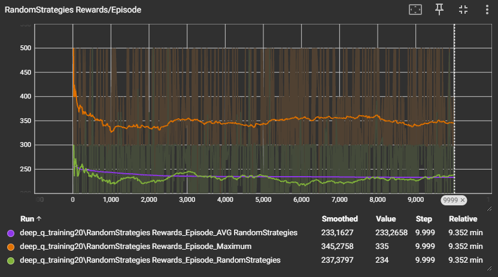
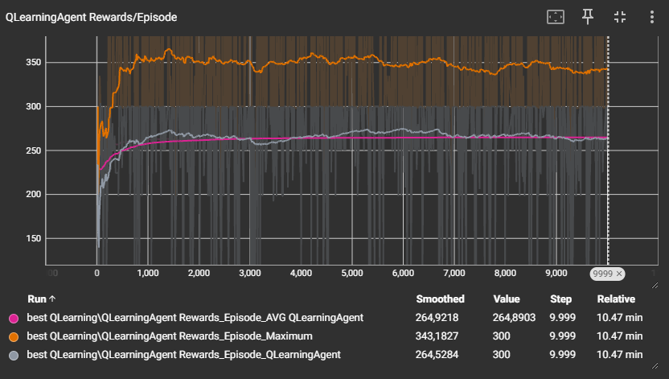
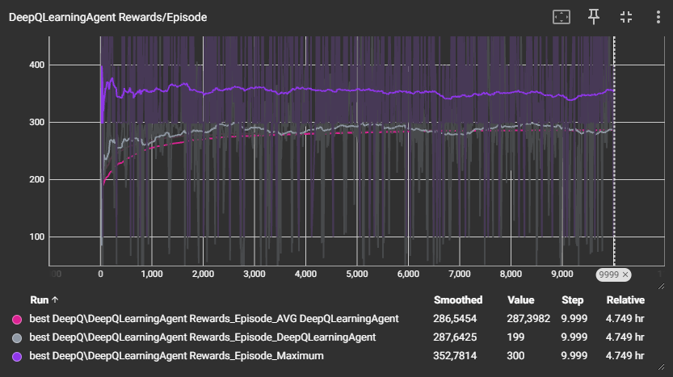
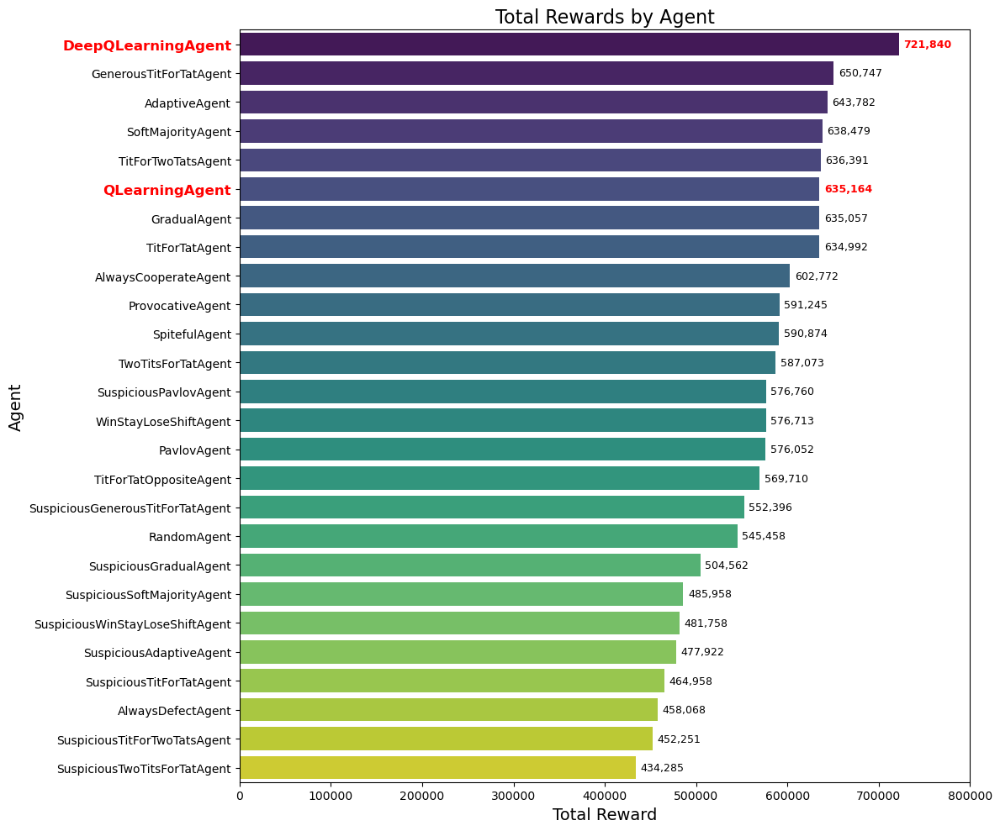

# Learning to Cooperate - Reinforcement Learning in the Iterated Prisoners Dilemma


This project explores the Iterated Prisoner's Dilemma (IPD) using Reinforcement Learning. A Q-Learning Agent and a Deep Q-Learning Agent are trained to optimize strategies against a total of 24 basic agents. I wanted to explore and show that RL agents are capable of breaking through the dilemma and learning behaviors like generosity, forgiveness, and kindness that are the keys to long-term rewards. This [poster](poster/poster.pdf) in German summarises all the important information and results.

## Table of Contents
1. [What is the IPD?](#what-is-the-ipd)
2. [Usage](#usage)
    1. [Download](#download)
    2. [Play a Game](#play-a-game)
    3. [Training](#training)
    4. [Tournament](#tournament)
    5. [App](#app)
3. [Results](#results)
4. [License](#license)
5. [Acknowledgement](#acknowledgement)

## What is the IPD?
The Iterated Prisoner's Dilemma (IPD) is a classic problem in game theory that models the tension between cooperation and competition in repeated interactions. In each round, 
two players independently decide 
either to cooperate (C) or to defect (D). Their decisions determine 
their rewards on the basis of a payoff matrix:
| **Player A/B**       | **Cooperate (C)** | **Defect (D)** |
|----------------------|-------------------|----------------|
| **Cooperate (C)**    | (3, 3)            | (0, 5)         |
| **Defect (D)**       | (5, 0)            | (1, 1)         |

*Table: payoff matrix*

The dilemma is that, from a rational point of view, it only makes sense to defect. If the aim is to win, that is also the right strategy. However, if the aim is to maximize the reward, the strategy is extremely poor. As [Robert Axelrod](https://en.wikipedia.org/wiki/Robert_Axelrod_(political_scientist)) has already shown, in the long term it is more worthwhile to focus on cooperation while still responding to your opponent's betrayal accordingly. That's why very simple strategies like Tit For Tat are superior to treacherous and resentful strategies.

## Usage
### Download
Clone this repository:
```bash
git clone https://github.com/Jonah-gr/Reinforcement-Learning-IPD.git
```
Go to the directory:
```bash
cd Reinforcement-Learning-IPD
```
Install with pip:
```bash
pip install .
```

You can simply execute the code using the terminal, for example:
### Play a Game
Let RandomAgent play against TitForTatAgent in a game of 10 rounds. 
```bash
python -m src.main game --agents "RandomAgent()" "TitForTatAgents()" --num_rounds = 10 
```
All basic agents are listed below:

| **Strategy** | **Description**   |
|--------------|-------------------|
| RandomAgent()                     | Decides randomly  |
| AlwaysCooperateAgent()            | Always cooperates  |
| AlwaysDefectAgent()               | Always defects  |
| ProvocativeAgent()                | Defects after cooperating twice   |
| TitForTatAgent()                  | Imitates the opponent   |
| TitForTwoTatsAgent()              | Defects if the opponent defects twice  |
| TwoTitsForTatAgent()              | Defects twice if the opponent defects |
| TitForTatOppositeAgent()          | Imitates the opponent oppositely    |
| SpitefulAgent()                   | Always defects if the opponent defects  |
| GenerousTitForTatAgent()          | Imitates the opponent but forgives 10% of the time |
| AdaptiveAgent()                   | Defects if the opponent defects more than 50% in the last 10 rounds |
| PavlovAgent()                     | Defects if decisions in the previous round were different  |
| GradualAgent()                    | Defects as often as the opponent defects  |
| WinStayLoseShiftAgent()           | Changes strategy if last reward < 1  |
| SoftMajorityAgent()               | Defects if the opponent defects more than 50% of the time  |
| SuspiciousTitForTatAgent()        | Imitates the opponent and defects in the first round |
| SuspiciousAdaptiveAgent()         | Defects if the opponent defects more than 50% in the last 10 rounds and defects in the first round |
| SuspiciousGenerousTitForTatAgent()| Imitates the opponent but forgives 10% of the time and defects in the first round |
| SuspiciousGradualAgent()          | Defects as often as the opponent defects and defects in the first round|
| SuspiciousPavlovAgent()           | Defects if decisions in the previous round were different and defects in the first round |
| SuspiciousSoftMajorityAgent()     | Defects if the opponent defects more than 50% of the time and defects in the first round |
| SuspiciousTitForTwoTatsAgent()    | Defects if the opponent defects twice and defects in the first round |
| SuspiciousTwoTitsForTatAgent()    | Defects twice if the opponent defects and defects in the first round |
| SuspiciousWinStayLoseShiftAgent() | Changes strategy if last reward < 1 and defects in the first round|

*Table: Basic Strategies*
In addition, the `QLearningAgent()` and the `DeepQLearningAgent()` can also be used in the same way, but with the option of setting parameters inside the brackets. However, this only makes sense if they are trained first:

### Training
Train `QLearningAgent()` with a learning rate of 0.1 and the `DeepQLearningAgent()` with a memory of the last 10 rounds:
```bash
python -m src.main train --agents "QLearningAgent(epsilon=0.1)" "DeepQLearningAgent(state_size=20, load_model=False)" --num_rounds 100 --episodes 1000
```
Log files are automatically created for tensorboard during training. These are saved in `runs/training` if no other location has been set with `--log_dir`. 
You can also use basic strategies in `--agents` to create comparability in tensorboard during training. You can download the `DeepQLearningAgent()` I trained [here](https://1drv.ms/u/c/298fc70cfd08a0db/EfU2y4UkQDBMiFsThy1h8Y8Bw7JoozjEV1xG6NsIy1h8zg?e=vS1mIA). 
After the training, it is then possible to have all agents compete against each other in a tournament:

### Tournament
Play a tournament in which each specified agent and all base strategies play 100 games of 100 rounds against each base strategy:
```bash
python -m src.main tournament --agents "QLearningAgent(q_table=[[0.4, 0.08562763], [2.17148565, 0.24526072]], epsilon=0.0)" "DeepQLearningAgent(state_size=20)" --num_rounds 100 --num_games 100
```
The results are saved in `runs/tournament/tournament_results.csv` if nothing else was specified with `--save_dir`. An analysis of the results is provided in [analysis.ipynb](/src/analysis.ipynb).

### App
To play against the trained `DeepQLearningAgent()` you can start the browser-based app:
```bash
python -m src.main app --path deep_q_agent.pt
```
Make sure that the path to the model is correct.

## Results

When training the `QLearningAgent(α=0.001, γ=0.95)` and `DeepQLearningAgent(state_size=20, α=0.001, γ=0.95)` (and `RandomStrategies()`) over 10000 epochs, each with a game of 100 rounds, the following results were obtained:

| **Agent**            | **RandomStrategies()** | **QLearningAgent(α=0.001, γ=0.95)** | **DeepQLearningAgent(state_size=20, α=0.001, γ=0.95)**
|----------------------|-------------------|----------------------|-------------------|
| **average reward per epoch** |  233  | 265 | 287 |


*purple: average reward, orange: highest possible reward, green: reward*

*pink: average reward, gray: reward, orange: highest possible reward*

*pink: average reward, gray: reward, purple: highest possible reward*

Furthermore, the following is the result of 
```bash
python -m src.main tournament --agents "QLearningAgent(q_table=[[52.7929238, 2.61803697], [0.9977664, 53.59111475]], epsilon=0.0)" "DeepQLearningAgent(state_size=20)" --num_rounds 100 --num_games 100
```


## License

This project is licensed under the MIT License. See the [LICENSE](/LICENSE) file for details.

## Acknowledgement

Great video by Veritasium: https://www.youtube.com/watch?v=mScpHTIi-kM&t

